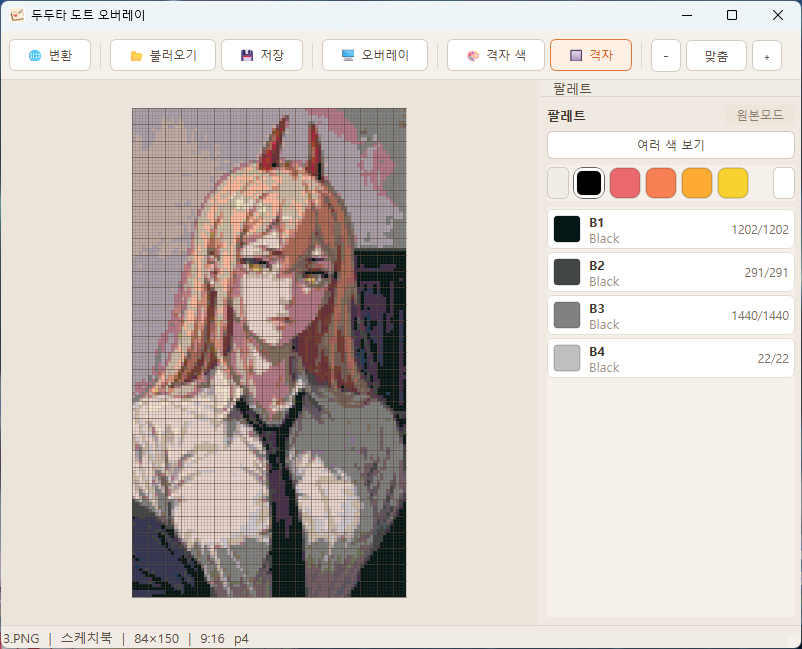
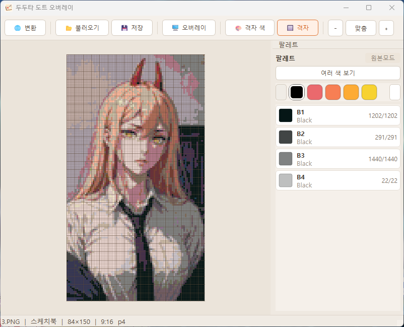
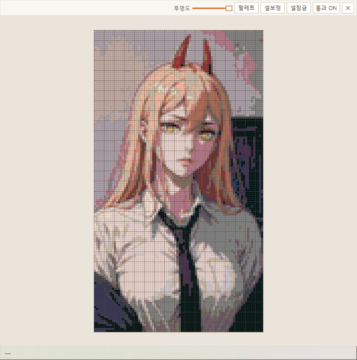

# 후원자 전용 윈도우 오버레이 프로그램

후원자만을 위한 윈도우 전용 오버레이 프로그램입니다.
개발자에게 후원 또는 커피한잔~ 을 보내주시면 게임화면 안에서 모든게 가능한 오버레이 프로그램을 보내드립니다.

---
## 후원

- [GitHub Sponsors로 후원하기](https://github.com/sponsors/chang-mini)
- [커피한잔의 여유(오픈카톡)](https://open.kakao.com/o/svvxQWki)
  
## 목차

1. [기본 화면](#1-기본-화면)
2. [파일 불러오기](#2-파일-불러오기)
3. [오버레이 띄우기](#3-오버레이-띄우기)
4. [오버레이 창 조작](#4-오버레이-창-조작)
5. [팔레트 — 색상 선택](#5-팔레트--색상-선택)
6. [세부 색 체크](#6-세부-색-체크)
7. [셀 보정](#7-셀-보정)
8. [통과 모드](#8-통과-모드-클릭스루)

---

## 1. 기본 화면

프로그램을 처음 실행하면 빈 캔버스와 상단 툴바, 우측 팔레트 패널이 표시됩니다.

| 버튼 | 기능 |
|------|------|
| 변환 | 이미지를 도트 데이터로 변환 |
| 불러오기 | 저장된 도트 파일(`.json`) 불러오기 |
| 저장 | 현재 작업 상태 저장 |
| 오버레이 | 게임 화면 위 오버레이 창 열기/닫기 |
| 그리드 색상 | 격자선 색상 변경 |
| 격자 | 격자선 표시 ON/OFF |
| 확대 / − 맞춤 + | 캔버스 줌 조절(프로그램 비율 조절시 맞춤 + 보입니다.)아니면 옆에 흰네모 버튼 나오면 나옵니다.|

---

## 2. 파일 불러오기

**불러오기** 버튼을 눌러 도트 파일(`.json`)을 열면 캔버스에 도안이 표시되고, 우측 팔레트에 사용된 색상 목록이 나타납니다.

- 각 색상 칩에는 **색 코드**, **그룹명**, **남은 칸 수 / 전체 칸 수**가 표시됩니다.
- 색상 칩을 클릭하면 해당 색이 활성화되어 오버레이에서 해당 위치만 강조됩니다.

---

## 3. 오버레이 띄우기

**오버레이** 버튼을 누르면 게임 화면 위에 반투명 도안 창이 올라옵니다.

- 오버레이 창은 항상 최상위에 유지됩니다.
- 게임 캔버스 위치에 맞게 창을 드래그해 이동하거나, 모서리를 드래그해 크기를 조절하세요.

---

## 4. 오버레이 창 조작

오버레이 창 상단 컨트롤 바에서 다양한 기능을 제어합니다.

| 컨트롤 | 기능 |
|--------|------|
| 투명도 슬라이더 | 오버레이 전체 투명도 조절 |
| 팔레트 | 팔레트 패널 열기 (색상 선택 및 진행 확인) |
| 셀보정 | 게임 격자와 오버레이 격자 정렬 보정 |
| 셀잠금 | 격자 크기/위치 고정 (잠금 상태에서는 줌 불가) |
| 통과 ON | 클릭스루 모드 활성화 (게임 조작 가능) |
| ✕ | 오버레이 창 닫기 |

---

## 5. 팔레트 — 색상 선택

**팔레트** 버튼을 누르면 오버레이가 팔레트 패널로 전환됩니다.

- **그룹**: 상단의 색상 원형 버튼으로 색상 그룹을 전환합니다. 모든 그룹 색상이 표시되며 사용하지 않는 색상 그룹은 X표시됩니다.
- **여러 색 보기**: 멀티모드로 전환해 여러 색을 동시에 오버레이에 표시합니다.
- **색상 칩**: 클릭하면 해당 색이 현재 작업 색으로 선택됩니다.
  - 숫자는 멀티모드에서의 선택 순서입니다.
  - `완료` 표시된 색은 모든 칸이 채워진 상태입니다.
- **하단 상태 바**: 현재 선택된 색의 완료 칸 수 / 전체 칸 수가 실시간으로 표시됩니다.

---

## 6. 세부 색 체크

| 색상 표시 | 완료 체크 후 |
|-----------|-------------|
|  |  |

팔레트에서 색을 선택하면 오버레이에 해당 색의 위치만 강조되어 표시됩니다.

- 게임에서 해당 칸을 채운 뒤, 팔레트의 **완료** 버튼을 누르면 오버레이에서 해당 색이 체크 처리됩니다.
- 완료된 칸은 오버레이에서 표시가 사라져 나머지 작업 위치를 더 명확하게 확인할 수 있습니다.

---

## 7. 셀 보정

오버레이 격자와 게임 캔버스 격자가 맞지 않을 때 **셀보정**을 사용합니다.

1. **셀보정** 버튼을 클릭하면 게임 화면 전체에 빨간 격자 박스가 나타납니다.
2. 박스를 드래그해 게임의 셀 하나에 정확히 맞춥니다.
3. **확인** 버튼을 누르면 격자 크기와 위상이 자동으로 계산되어 오버레이에 적용됩니다.
4. 보정 완료 후 **셀잠금**이 자동으로 ON 됩니다.

---

## 8. 통과 모드

| 통과 ON — 오버레이 뒤로 게임 조작 | 통과 on 팔레트 색칠 |
|----------------------------------|----------------|
|  |  |

**통과 ON** 버튼을 누르면 오버레이가 마우스 클릭을 투과해 게임을 직접 조작할 수 있게 됩니다.
- 통과 모드가 활성화되면 오버레이 위에 **컨트롤 바**을 눌러 이동이 가능합니다.
- **통과 OFF** 버튼을 눌러 일반 모드로 돌아옵니다.
